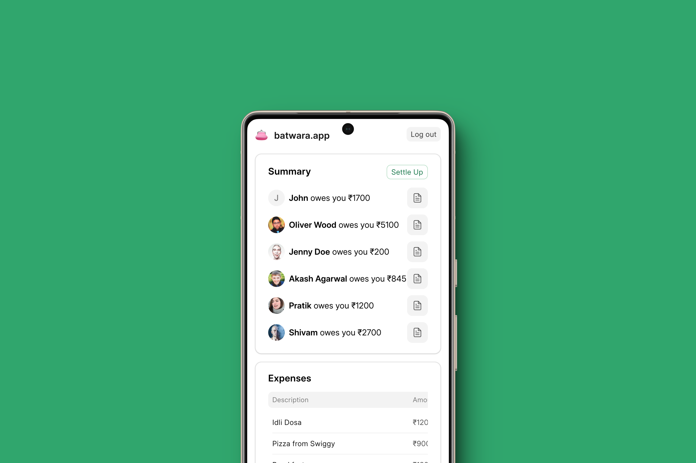

### Batwara, Simple & Open Source Splitwise Alternative



### ✨ Features

Batwara is an modern and simple web based *udhar* (how much your friends owe you?) tracker.

* Invite friends via SMS (twilio integration)
* Record Expenses, Split with Friends
* Attach Receipts
* View Transaction History
* Quick Summary of Balances


### 🧑🏼‍💻 Tech Stack

* [Frappe Framework](https://frappeframework.com)
* [Vue with FrappeUI](https://frappeui.com)
* [TailwindCSS](https://tailwindcss.com)

### Future Scope

* AI + Telegram integration for tracking with natural language
* Groups with friends
* PWA setup with Ionic

### 💿 Installation

You can install this app using the [bench](https://github.com/frappe/bench) CLI:

```bash
cd $PATH_TO_YOUR_BENCH
bench get-app $URL_OF_THIS_REPO --branch main
bench install-app batwara
```

### 👥 Contributing

This app uses `pre-commit` for code formatting and linting. Please [install pre-commit](https://pre-commit.com/#installation) and enable it for this repository:

```bash
cd apps/batwara
pre-commit install
```

Pre-commit is configured to use the following tools for checking and formatting your code:

* ruff
* eslint
* prettier
* pyupgrade

### ⚙️ CI

This app can use GitHub Actions for CI. The following workflows are configured:

* CI: Installs this app and runs unit tests on every push to `develop` branch.
* Linters: Runs [Frappe Semgrep Rules](https://github.com/frappe/semgrep-rules) and [pip-audit](https://pypi.org/project/pip-audit/) on every pull request.

### 📓 License

agpl-3.0
